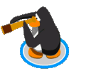
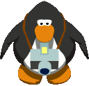
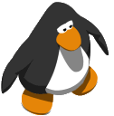

  

<h1 align="center">Club Penguin: Elite Penguin Force (DS) &times; CP Chilled</h1>

  &nbsp;
  &nbsp;
  

Play the 2008 Nintendo DS game on your phone, log in with your <a href="https://cpchilled.com">CP Chilled</a> account and
upload the coins and clothes you earn to your penguin on the island.

The original game talked to Nintendo Wi-Fi Connection and Disney servers that shut down years ago. This patch points those
Wi-Fi features at CP Chilled instead, so **Upload/Download** in the game works again:

| In the game | What happens on CP Chilled |
|---|---|
|  **Upload Coins** | The coins land in your account, with a "CP Chilled DS" coin screen the next time you're on the island |
|  Clothes you bought or earned on the DS | Added to your inventory along with the coins (99 of the game's items have an online twin, Santa Hat to Tweed Coat) |
|  First upload | You also get the **EPF Certificate** award, just like the original service gave |
|  **Take Online Poll** | A real CP Chilled poll with live results |
|  **Download Newsletter** | The archived newsletter, picture included |

 

## What you need

 **Your own copy of the game.** This repo does not contain the game. You
need a dump of the US cartridge, *Club Penguin: Elite Penguin Force* (`CLPE`, 64 MB, the `(USA) (En,Fr,Es) (Rev 2)`
release). The patch checks the file and refuses anything else.

 **A CP Chilled account.** Make one at [cpchilled.com](https://cpchilled.com)
if you haven't. The DS keyboard only has letters and digits, so the game uses a separate **DS password**: log in at
[play.cpchilled.com](https://play.cpchilled.com), open **Settings** in the dock and press **Generate DS password**. It is shown
once (write it down); your normal password keeps working on the website.

 **An emulator with DS Wi-Fi.** On iPhone and iPad we use
[JOY](https://apps.apple.com/us/app/joy-multi-system-emulator/id6754980046) from the App Store. On a computer,
[melonDS](https://melonds.kuribo64.net/) works (see [Desktop](#desktop-melonds) below).

 

## iPhone / iPad in four steps

### 1. Get the patch

Open the [latest release](../../releases/latest) on your phone and tap **`epf-cpchilled.bps`**. Safari saves it to
**Files → Downloads**. (The release also has a zip with the patch and the desktop tools, if you prefer that.)

### 2. Patch your game in the browser

No app needed: the patch is applied by a web page that runs entirely on your phone, nothing is uploaded anywhere.

1. Put your game dump somewhere you can reach from **Files** (iCloud Drive, "On My iPhone", or AirDrop it from a computer).
2. Open **[RomPatcher.js](https://www.marcrobledo.com/RomPatcher.js/)** in Safari.
3. **ROM file** → *Choose File* → pick your `.nds` dump.
4. **Patch file** → *Choose File* → pick `epf-cpchilled.bps` from Downloads.
5. Tap **Apply patch**. Safari saves `Club Penguin - Elite Penguin Force (patched).nds` (or similar) to Downloads.

If the page says the ROM doesn't match, your dump isn't the US Rev 2 release; the patch only fits that one.

### 3. Install JOY and load the game

1. Install **JOY Emulator** from the [App Store](https://apps.apple.com/us/app/joy-multi-system-emulator/id6754980046) (free).
2. Open JOY, pick **Nintendo DS**, and use its **Import** / **+** button to browse **Files**.
3. Choose the patched `.nds` from Downloads. JOY keeps the file name as-is, so you'll see it in the DS list. Tap it to play.

### 4. Log in and upload coins

1. On the title screen choose **Continue** (or start a new game first). Don't use *Guest*: guests have no coins to upload.
2. From the main menu tap **Upload/Download**.
3. Tap **Connect to Nintendo Wi-Fi Connection** and confirm. The emulator passes the DS's Wi-Fi through to the internet.
   If the game says it can't find a connection, open **Nintendo Wi-Fi Connection Setup**, pick *Connection 1* and
   search for an access point; choose the one the emulator offers, save, and try again.
4. **Select a Club Penguin Account** → pick an empty slot and type your CP Chilled **username** and **password** (or your
   DS password from Settings). The game remembers the slot, so you only type it once.
5. You're in. Tap **Upload Coins**, use **+** to pick an amount (steps of 50, up to 2000 per upload, 10,000 per day) and
   confirm with the green check. "Coin upload complete!" means the coins have left the DS and are waiting on the island.
6. Log in at [play.cpchilled.com](https://play.cpchilled.com). You'll get the coin screen first, then one
   "has been added to your inventory" prompt for each DS item that came across.

 

## Desktop (melonDS)

 If you'd rather play on a computer:

1. Apply the patch with [RomPatcher.js](https://www.marcrobledo.com/RomPatcher.js/), [Floating IPS](https://www.smwcentral.net/?p=section&a=details&id=11474)
   or any BPS tool, or run the Python patcher in `tools/` on your dump
   (`patch-epf-rom.ps1 "path\to\your dump.nds"` on Windows, needs Python 3; it installs `ndspy` on first run).
2. In melonDS open **Config → Wi-Fi settings** and make sure **Direct mode is off** (the default "indirect" mode gives the
   DS internet access through your computer).
3. Same in-game steps as above.

 

## Troubleshooting

| | |
|---|---|
|  **Error 52xxx / "unable to connect"** | The emulator isn't letting the DS reach the internet. Check its Wi-Fi/network setting (melonDS: Direct mode off) and your phone's connection. |
|  **"Login failed"** | Wrong username or DS password. Make a new one under Settings on the website. Five failed tries lock the connection for an hour. |
|  **Upload Coins shows 0 coins** | You're on the *Guest* profile. Go back and choose *Continue* on your save. |
|  **"Coin upload failed"** | You hit the daily limit (10,000) or the per-upload limit, or the account is banned. The coins stay on your DS. |
|  **Download Mission fails** | Known issue with emulated Wi-Fi. The missions are coming another way; ask in Discord. |

 

## Good to know

- The DS cannot do modern HTTPS, so the game talks to `ds.cpchilled.com` over plain HTTP, the way the Nintendo Wi-Fi
  Connection generation of games did. Your password is sent in the clear on that connection: use a DS password that you
  don't use anywhere else.
- Coins and items are credited by CP Chilled's server with the same limits as the website, and each DS item is granted once
  per account. Items with no online equivalent (the Pro Board, the Handler Hat, the mini-game medals) stay on the DS.
- The patch only rewrites the server addresses inside the game (`nas.nintendowifi.net`, `console.clubpenguin.com`,
  `home.disney.go.com`). Nothing else about the game changes.

## What's in this repo

| Path | |
|---|---|
| `patch/epf-cpchilled.bps` | The patch (about 1 MB). Also attached to every release. |
| `tools/patch-epf-rom.py`, `tools/epflib.py`, `tools/patch-epf-rom.ps1` | Make the patched ROM yourself from your dump (Python 3 + `ndspy`). |
| `tools/make-bps.py` | How the `.bps` is built and verified (`build`) or applied (`apply`) with plain Python. |
| `assets/` | The icons and animations used on this page, from the CP Chilled Discord. |

Everything the server does with the game's requests is documented in the main CP Chilled project.
Questions and bugs: [discord.gg/Q2DpxQBnW](https://discord.gg/Q2DpxQBnW).

Unofficial fan project. Club Penguin and Elite Penguin Force are trademarks of Disney; Nintendo DS is a trademark of
Nintendo. No game files are distributed here; you need your own copy of the cartridge.
